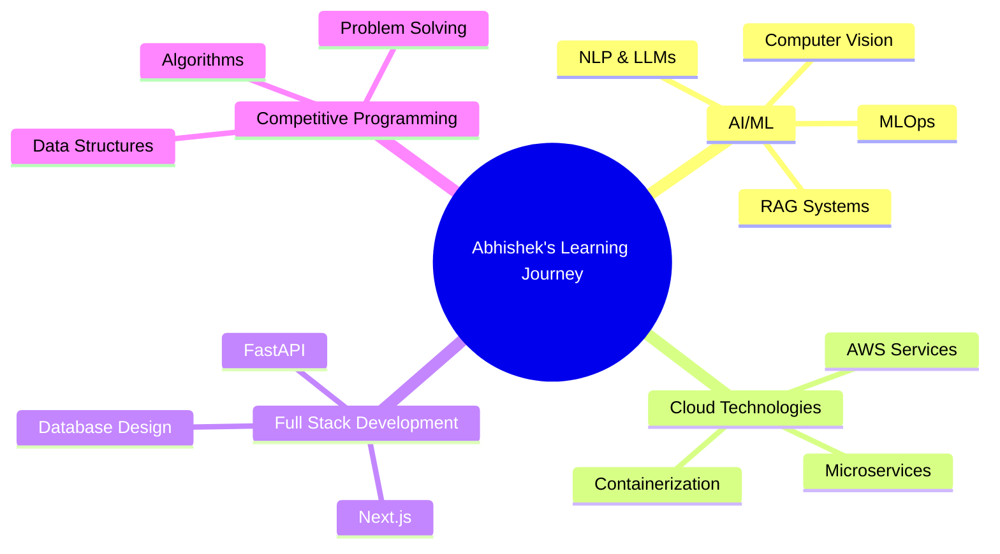

# Hi there, I'm Abhishek Parmar! 👋

<div align="center">
  
[](https://git.io/typing-svg)

</div>

<div align="center">
  
</div>

---

## 🚀 About Me

```python
class Abhishek:
    def __init__(self):
        self.name = "Abhishek Parmar"
        self.role = "Data Science & AI Enthusiast"
        self.education = "B.Tech Computer Science @ CHARUSAT"
        self.location = "Vadodara, Gujarat, India"
        
    def current_focus(self):
        return [
            "Building AI-powered applications",
            "Mastering MLOps and Cloud Technologies",
            "Contributing to Open Source",
            "Competitive Programming"
        ]
    
    def fun_fact(self):
        return "I've solved 400+ algorithmic challenges and love turning ideas into code! 🧠💻"
```

---

## 🛠️ Tech Stack

<div align="center">

### Languages


### AI/ML & Data Science


### Web Development


### Databases & Cloud


### Tools & Platforms


</div>

---

## 📊 GitHub Analytics

<div align="center">
  
  
</div>

<div align="center">
  
</div>

<div align="center">
  
</div>

---

## 🏆 Achievements & Certifications

<div align="center">

[](https://aws.amazon.com/certification/certified-cloud-practitioner/)
[](https://www.hackerrank.com/)
[](https://nptel.ac.in/)

</div>

### 🎯 Key Highlights:
- 🥇 **Top 8** at Gateway Group Hackathon (100+ participants)
- 💪 **400+ Algorithmic Challenges** solved across platforms
- ⭐ **5-Star Coder** in C/C++ on HackerRank
- 🎓 **CGPA: 9.64/10.0** in Computer Science
- 📜 **3 NPTEL Certifications** in DS&A, DBMS, and Deep Learning

---

### 🎯 Project Highlights:

#### 🤖 Mockly - AI Interview Prep Platform
- **Tech Stack:** Next.js, FastAPI, MongoDB, OpenCV, PyTorch
- **Features:** Real-time analysis of technical & behavioral responses
- **Impact:** 10% improvement in transcription quality with Whisper-large-v3

#### 📚 IntelliDoc - Multilingual Document Q&A
- **Tech Stack:** Streamlit, PyTorch, Milvus, Mistral NeMo
- **Features:** RAG-based system with intelligent chunking
- **Impact:** 16% accuracy boost over LLaMA 3 8B on MMLU benchmark

#### 👥 AttendX - Smart Attendance System
- **Tech Stack:** Python, Flask, React Native, PostgreSQL
- **Features:** ML-powered face recognition with 200ms response
- **Impact:** 40% faster processing, 35% improved throughput

---

## 📈 Coding Activity

<div align="center">
  
</div>

<div align="center">
  
  
</div>

---

## 🎯 Current Focus Areas



---

## 🤝 Let's Connect!

<div align="center">

[](https://www.linkedin.com/in/abhishekparmar2910/)
[](https://github.com/2910Abhishek)
[](https://abhishek-portfolio-opal.vercel.app/)
[](mailto:abhishekparmar2904@gmail.com)

</div>

---

<div align="center">
  
  
  ### ✨ "Code is like humor. When you have to explain it, it's bad." - Cory House ✨
  
  
  
</div>

---

<div align="center">
  
</div>
